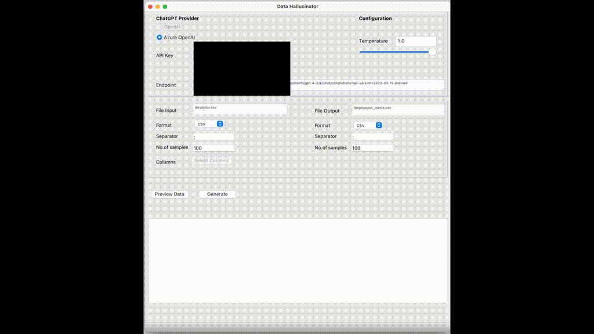

# Data Hallucinator
 
Data Hallucinator is a Qt C++ application that utilizes GPT's hallucination effects to generate new data from a given input CSV file. The application can read CSV files either from a local volume or directly from a given web URL. The generated data can be used for various purposes, such as data analysis, machine learning, or any other application where synthesized data is required.

### Application Demo

### Features
 

* Read CSV files from local volume or web URL
* Utilize GPT-4's hallucination effects for data generation
* Export generated data in CSV format
* User-friendly GUI for easy interaction
* Auto-saves your last successful entries in your home dir and loads them on next start
* Dark Mode support (depending on your OS setting)

### Requirements
 
* Qt 4 or later
* C++11 or later
* GPT OpenAI or Azure Open AI Access with GPT Models deployed

### Limitations

* Not all features from the full csv specification are supported (multiline columns, quotes, special escaping)
* YMMV even with GPT4 32K Model on the No. of samples 

### Contributing
 
If you would like to contribute to this project, please feel free to submit a pull request or open an issue for discussion.
License
 
Data Hallucinator is released under the GNU Affero General Public License v3.0.